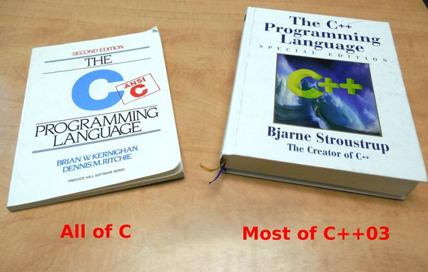

#   Three years with Abstractionless C

Recently, "to C or not to C" became a topic on HN, which is a nice
excuse to spend couple hours on [ABC][c] retrospective. The decision
to work in C was rather natural: the author is a C/Go, not C++/Rust
kind of person, so once go runtime became a problem, C was the
most straightforward answer. The dirty secret of both C++ and C is
that these two are like IKEA or LEGO languages. Languages to create
other languages. For example, virtually any serious C++ user has
some sort of alternative standard library (Abseil, QT, there are
many). You don't use C or C++ as-is, normally. C standard library 
is small by design, so that is inevitable for most use cases.
C++/C standard libraries are sort of a very mixed bag, effectively
a chronicle of CS ideas for the last 40-50 years. If C standard lib
is kind of a manuscript chamber in a faraway monastery, C++ std lib
is more like the Library of Congress. Nobody knows it all, and most
of the ideas written are definitely not recommended today.

Abstractionless C resulted from many frustrations with C++ and its
endless quirks. I needed generics, STL-like containers, disk and
network serialization, some standard algorithms, with no pointer 
arithmetics and no malloc/free headaches. Coming from Go, I clearly 
needed slices. That was the pragmatic problem statement. On the
higher level, I wanted to avoid the tower-of-abstractions trap that
I felt quite sharply in C++. There, same bytes packaged differently
become an entirely different incompatible story (like `std::string`
vs `std::vector<char>` vs `std::vector<uint8_t>` etc). The fact
that C++ `char` is neither signed nor unsigned and all those quirks
that sound like a really strange religion -- those drive me mad.

So the set of architectural choices was:

 0. All primitive types have specified bit width and layout; that
    gives serialization for free (`u32`, `i64`, `sha256`, etc).
 1. Slices as arrays of two typed pointers, e.g. a byte slice is
    `typedef u8* u8s[2];` and a slice is non-owning.
 2. Memory-owning buffers as arrays of four pointers, effectively
    ring buffer logic or ptr/len/cap constructs is built in.
 3. Generics through C templates, a known technique, enough for
    STL-level containers.
 4. *Solid* containers, pointer chasing and malloc be damned.
    Vectors, heaps, open addressed hash maps, LSM sorted sets.
 5. Naming conventions to enforce module structure, e.g.
    `void SHA1Sum(sha1* hash, u8csc from)` declared in `SHA1.h`,
    implemented in `SHA1.c`, tested in `test/SHA1.c`, etc.

Slices and generics are a bit unexpected in C, the rest is just
another C style, nothing out of the ordinary. The obvious issue
here is that C does not support slices in any of its standard APIs.
But, the C standard library is not that huge, and its usable part
is even less, so unless a function is a syscall or somehow
preferentially treated by the compiler, what is the value of it?
Diminishingly zero. Especially in the LLM era. What has a lot of
value is the toolchain that understands C and the OS kernel. Those
are true megaprojects.

So, I sketched some skeleton of my (un)standard lib and started
working with it. The "meat" slowly grew, the thing saw one or two
refactors along the way, but it mainly remains a collection of
small and focused modules with slice-based APIs and increasingly
rare malloc use. The cases for malloc go down for the following
reasons:

 1. anything multiple-page sized can be mmapped directly,
 2. smaller things can live on stack,
 3. containers are solid (#1),
 4. ABC buffers can work as arenas for variable-length content,
    so you deal with `u8cs` (two-pointer slice) and the bytes
    live in the arena,
 5. there is a lot of mmapped file use (in-RAM bit layout
    matches on-disk layout, forget SPARCs and Alphas already),
 6. the remaining cases are either `malloc` or something else.

Out of remaining burning questions one may mention package and
dependendency management. Obviously, for C that is RPM, APT, apk,
Brew and so on. I am not going to bring along second copies of
CURL, libsodium, and all the other usual suspects.

So for my purposes, it worked out fine. As L.Torvalds once said: 
"Standards are paper. Buy some and write your own."
Or something like that.

[c]: https://github.com/gritzko/libabc
