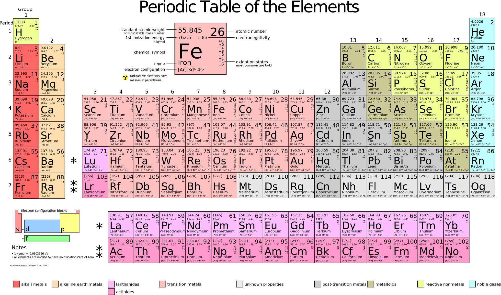
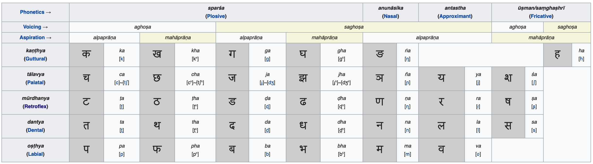

#   Beagle revision contol: inner workings

This post is a status update on the progress of the Beagle revision control
system project. In the last two months, Beagle became 90% dogfooded, which
is probably the key achievement. In also survived major changes in its
inner workings.

The RDX-based CRDT storage engine was phased out in favor of git-compatible
backend. The original choice was driven by the high cost of (re)building 
AST trees. Once Beagle switched from tree-sitter to [ragel-based][r] *dogenizers*,
that problem went away. So, blob store is now good enough and git compatibility 
is definitely a huge huge win. Things implemented and now used daily are: 
clone from a git repo, push to a git repo, stage, commit, merge, diff and so on.
All diffs and merges are syntax-aware. Tens of languages are supported.

Another story that unfolded in two months was the HTTP/URI command language.
The original idea was to refactor RCS command language around HTTP primitives:
verbs (`get`, `post`, `put`, `delete`, `patch`) and URIs. 

  - `GET` extract data from repo into the working tree;
  - `POST` advance a branch (fast-forward, rebase, or commit);
  - `PATCH` merge other version into the working tree;
  - `PUT` stage file/path for commit;
  - `DELETE` stage file/path for deletion;
  - last but not least: verbless use for read-only things (log, blame, etc)

The way verbs are defined, their work is strictly orthogonal. It is impossible
to substitute one verb with creative use of another verb. At the same time,
any required function can be achieved by a combination of commands.

In the same way we approach URIs. A standard [RFC 3986 URI][u] has five parts. Each
part describes some aspect of the command. It is impossible to express the meaning 
of one part by creatively using another, but all the required functions can be 
expressed by some shape of an URI. So, each part is like a separate "dimension"
*x*, *y*, or *z*:

 1. `scheme:` the access protocol, also creatively reused for *projections*;
 2. `//authority` (host), the remote host, sometimes e-mail;
 3. `/path/`, naturally a repo-relative path;
 4. `?query`: the version formula (branch, hash, all the git tilde/dot spells);
 5. `#fragment` is the *message* - some free form text used as a label or a
    search term (e.g. setting commit message or picking a commit by a substring).

Overall, 5 URI fragments being defined/absent means `2**5=32` URI shapes, all
of them meaningful. If multiplied by 6 verbs, `32*6=192` command shapes. This
way, `be` drops CLI flags entirely. All the necessary semantics is achieved
by recombining the orthogonal primitives. For example, 

  - `be get ssh://host/path?branch` makes fetch-and-checkout of a 
    particular remote branch.
  - `be post '?./fix#in progress'` stashes the worktree changes into a
    child branch `fix` (advances a new branch from 0 to the new commit)
  - `be get ?.#indexes` checks out a commit containing "indexes" in the
    message, in the current branch' history
  - `be patch ?./fix` applies the stash back to the working tree

URI syntax might be cryptic with special symbols at times, but most programming
languages are. The good part, it is extremely familiar to people and LLMs alike 
and more predictable than historically-defined CLI flags one has always look up 
on SO/Claude/Google.

A major inspiration for this approach is the periodic table of elements, which
was in turn inspired by Sanskrit sound table (above). 

[u]: https://datatracker.ietf.org/doc/html/rfc3986
[r]: https://www.colm.net/open-source/ragel/
